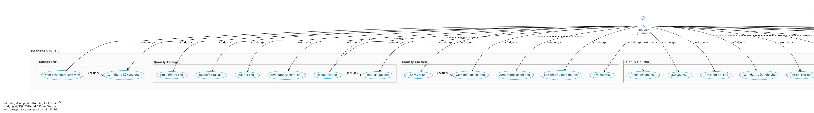

# CTUPal

**CTUPal** là ứng dụng web quản lý sinh viên được phát triển bằng PHP thuần, giúp sinh viên Đại học Cần Thơ quản lý hiệu quả các hoạt động học tập và đời sống cá nhân. Ứng dụng có giao diện hiện đại, responsive và tích hợp nhiều tính năng hữu ích.

## 🎯 Tính năng chính

### Dành cho Sinh viên
- **Dashboard tổng quan:** Hiển thị thống kê số ghi chú, tổng chi tiêu tháng hiện tại và số tài liệu đã lưu
- **Quản lý lịch học:** Tích hợp Google Calendar để xem lịch học và sự kiện cá nhân
- **Quản lý tài liệu:** Upload, phân loại, tìm kiếm và tải về tài liệu học tập (hỗ trợ PDF, Word, Excel, PowerPoint, hình ảnh)
- **Quản lý chi tiêu:** Theo dõi chi tiêu hàng ngày với biểu đồ thống kê trực quan (Chart.js)
- **Quản lý ghi chú:** Tạo, chỉnh sửa, xóa và phân loại ghi chú học tập/cá nhân
- **Thông tin cá nhân:** Cập nhật profile, đổi mật khẩu, quản lý thông tin liên hệ

### Dành cho Quản trị viên
- **Dashboard admin:** Thống kê tổng số tài khoản, tài khoản hoạt động và bị khóa
- **Quản lý tài khoản:** Thêm, sửa, xóa, khóa/mở khóa tài khoản sinh viên
- **Bảo mật dữ liệu:** Admin chỉ quản lý tài khoản, không thể truy cập dữ liệu cá nhân của sinh viên

## 🏗️ Kiến trúc hệ thống

### 📊 Sơ đồ Use Case
Xem sơ đồ use case tổng quát của hệ thống tại: [`docs/USE_CASE_DIAGRAM.md`](docs/USE_CASE_DIAGRAM.md)



### Cấu trúc thư mục
```
CTUPal/
├── admin/                  # Hệ thống quản trị
│   ├── index.php          # Dashboard admin
│   └── users.php          # Quản lý tài khoản
├── assets/
│   ├── icon/logo.svg      # Logo ứng dụng
│   └── js/
│       ├── charts.js      # Biểu đồ Chart.js
│       └── toast.js       # Hệ thống thông báo
├── config/
│   └── db.php             # Cấu hình database và utility functions
├── docs/                    # Tài liệu dự án
│   ├── USE_CASE_DIAGRAM.md  # Mô tả chi tiết use case
│   ├── use-case-diagram.puml # Source PlantUML cho sơ đồ
│   └── *.png               # Hình ảnh sơ đồ use case
├── includes/
│   ├── header.php         # Header và navigation
│   └── footer.php         # Footer và scripts
├── src/
│   ├── input.css          # Source Tailwind CSS
│   └── output.css         # CSS đã build
├── uploads/               # Thư mục lưu file upload (theo user)
├── views/                 # Template views
│   ├── documents-view.php
│   ├── expenses-view.php
│   └── notes-view.php
├── calendar.php           # Quản lý lịch học
├── documents.php          # Quản lý tài liệu
├── expenses.php           # Quản lý chi tiêu  
├── notes.php              # Quản lý ghi chú
├── profile.php            # Thông tin cá nhân
├── login.php              # Đăng nhập
├── register.php           # Đăng ký
├── logout.php             # Đăng xuất
├── index.php              # Dashboard sinh viên
└── database.sql           # Script khởi tạo database
```

### Cơ sở dữ liệu
- **users:** Thông tin tài khoản (admin/user), profile
- **documents:** Metadata file tài liệu đã upload
- **expenses:** Dữ liệu chi tiêu cá nhân
- **notes:** Ghi chú và phân loại

## 🛠️ Công nghệ sử dụng

### Backend
- **PHP 7.4+:** Ngôn ngữ chính, không sử dụng framework
- **MySQL 5.7+:** Cơ sở dữ liệu quan hệ
- **Session-based Authentication:** Quản lý đăng nhập và phân quyền

### Frontend
- **Tailwind CSS 4.x:** Framework CSS utility-first
- **Chart.js:** Thư viện biểu đồ JavaScript
- **FontAwesome:** Bộ icon
- **Vanilla JavaScript:** Xử lý tương tác client-side

### Tích hợp bên ngoài
- **Google Calendar:** Nhúng lịch học/sự kiện
- **File Upload System:** Hỗ trợ multiple file types với validation

## ⚙️ Cài đặt và triển khai

### Yêu cầu hệ thống
- XAMPP/WAMP/LAMP với PHP 7.4+
- MySQL 5.7+
- Web browser hiện đại

### Hướng dẫn cài đặt

1. **Chuẩn bị môi trường**
   ```bash
   # Tải và cài đặt XAMPP
   # Khởi động Apache và MySQL
   ```

2. **Thiết lập database**
   - Truy cập phpMyAdmin: `http://localhost/phpmyadmin`
   - Tạo database mới: `student_manager`
   - Import file `database.sql`

3. **Cấu hình ứng dụng**
   - Copy source code vào `C:/xampp/htdocs/CTUPal`
   - Chỉnh sửa `config/db.php` nếu cần (host, username, password)
   - Đảm bảo thư mục `uploads/` có quyền ghi

4. **Cài đặt Tailwind CSS (tùy chọn)**
   ```bash
   npm install tailwindcss @tailwindcss/cli
   npx @tailwindcss/cli -i ./src/input.css -o ./src/output.css --watch
   ```

5. **Truy cập ứng dụng**
   - URL: `http://localhost/CTUPal`
   - Đăng ký tài khoản sinh viên hoặc sử dụng admin account

## 👤 Tài khoản mặc định

### Admin
- **Email:** `admin@studentmanager.com`
- **MSSV:** `ADMIN001`  
- **Password:** `admin123`

### Sinh viên
- Tự đăng ký bằng email CTU: `@student.ctu.edu.vn`
- MSSV tự động tách từ email (format: username + B + 7 số)

## 📋 Mô tả chi tiết chức năng

### 1. Hệ thống đăng nhập/đăng ký
- **Đăng ký:** Chỉ chấp nhận email sinh viên CTU, tự động tách MSSV
- **Đăng nhập:** Hỗ trợ email hoặc MSSV, có tùy chọn "Ghi nhớ"
- **Phân quyền:** Tự động phân biệt admin/user và chuyển hướng tương ứng
- **Bảo mật:** Password hash bằng bcrypt, session timeout

### 2. Dashboard
- **Sinh viên:** Hiển thị thống kê ghi chú, chi tiêu tháng này, số tài liệu
- **Admin:** Thống kê tổng tài khoản, active/inactive users, danh sách user mới

### 3. Quản lý lịch học
- Nhập Google Calendar ID để nhúng lịch cá nhân
- Hiển thị lịch học/sự kiện trực tiếp trên web
- Hướng dẫn chi tiết cách lấy Calendar ID

### 4. Quản lý tài liệu
- **Upload:** Multiple files, drag & drop support
- **Phân loại:** Bài giảng, Bài tập, Thi cử, Tài liệu tham khảo, Khác
- **Tìm kiếm:** Theo tên file, mô tả, danh mục
- **Download/Delete:** Quản lý file cá nhân
- **Bảo mật:** Mỗi user có thư mục riêng, không thể truy cập file của người khác

### 5. Quản lý chi tiêu
- **Thêm chi tiêu:** Số tiền, danh mục, mô tả, ngày, phương thức thanh toán
- **Danh mục:** Ăn uống, Di chuyển, Học tập, Giải trí, Mua sắm, Y tế, Khác
- **Thống kê:** Biểu đồ doughnut cho tháng hiện tại và hôm nay
- **Lọc:** Theo tháng, danh mục, phương thức thanh toán

### 6. Quản lý ghi chú
- **CRUD operations:** Tạo, đọc, cập nhật, xóa ghi chú
- **Phân loại:** Học tập, Cá nhân, Công việc, Ý tưởng, Khác
- **Tìm kiếm/Lọc:** Theo tiêu đề, nội dung, danh mục
- **Validation:** Giới hạn độ dài title/content

### 7. Thông tin cá nhân
- **Cập nhật profile:** Họ tên, số điện thoại, ngày sinh
- **Đổi mật khẩu:** Yêu cầu mật khẩu hiện tại, xác nhận mật khẩu mới
- **Validation:** Kiểm tra độ mạnh mật khẩu, format số điện thoại

### 8. Hệ thống Admin
- **Quản lý tài khoản:** View, add, edit, delete, activate/deactivate users
- **Tìm kiếm:** Theo tên, email, MSSV
- **Bảo mật:** Admin không thể xem dữ liệu cá nhân của user
- **Logs:** Theo dõi hoạt động đăng ký, đăng nhập

## 🔒 Bảo mật

### Authentication & Authorization
- Session-based authentication với timeout
- Role-based access control (admin/user)
- Password hashing với bcrypt
- CSRF protection cho forms quan trọng

### File Upload Security  
- Whitelist file extensions
- File size limits (20MB max)
- User-specific upload directories
- Path traversal prevention
- File type validation

### Data Privacy
- Admin chỉ quản lý accounts, không truy cập được personal data
- User data isolation (documents, expenses, notes)
- Input sanitization và SQL injection prevention

## 🎨 Giao diện & UX

### Design System
- **Responsive Design:** Tối ưu cho desktop, tablet, mobile
- **Color Coding:** Mỗi module có màu sắc riêng biệt
- **Interactive Elements:** Hover effects, smooth transitions
- **Toast Notifications:** Thông báo trạng thái realtime

### Components
- **Cards:** Hiển thị thông tin và statistics
- **Forms:** Validation realtime với error messages
- **Tables:** Sortable, searchable với pagination
- **Charts:** Interactive doughnut charts với empty state
- **Modals:** Confirmation dialogs cho actions quan trọng

## 🚀 Performance & Optimization

- **Database:** Optimized queries với indexing
- **Frontend:** Minified CSS, optimized images
- **Caching:** Browser caching cho static assets
- **Lazy Loading:** Charts chỉ load khi cần thiết

## 📱 Compatibility

- **Browsers:** Chrome 90+, Firefox 88+, Safari 14+, Edge 90+
- **Mobile:** iOS Safari, Chrome Mobile, Samsung Browser
- **Screen Sizes:** 320px - 4K resolution

## 🔧 Development

### Build Process
```bash
# Watch Tailwind CSS changes
npx @tailwindcss/cli -i ./src/input.css -o ./src/output.css --watch

# Development server (via XAMPP)
http://localhost/CTUPal
```

### Code Structure
- **MVC Pattern:** Separation of concerns
- **Reusable Components:** Header, footer, forms
- **Utility Functions:** Database helpers, validation, file handling
- **Error Handling:** Try-catch blocks, user-friendly error messages

## 📊 Database Schema

### Users Table
- id, name, email, mssv, phone, password, birthday
- role (admin/user), is_active, google_calendar_id
- created_at timestamp

### Documents Table  
- doc_id, user_id, title, description, file_name, file_path
- file_size, file_type, category, subject, created_at

### Expenses Table
- expense_id, user_id, amount, category, description
- expense_date, payment_method, created_at

### Notes Table
- note_id, user_id, title, content, category
- created_at, updated_at

## 🤝 Contributing

1. Fork the repository
2. Create feature branch (`git checkout -b feature/AmazingFeature`)
3. Commit changes (`git commit -m 'Add AmazingFeature'`)
4. Push to branch (`git push origin feature/AmazingFeature`)
5. Open Pull Request

## 📝 License

Dự án phục vụ mục đích học tập và nghiên cứu, phi thương mại.

**Tác giả:** Trần Công Lập  
**Phiên bản:** 1.0.0  
**Ngôn ngữ:** Tiếng Việt

## 🎉 Kết luận

CTUPal là giải pháp quản lý toàn diện dành cho sinh viên với:
- ✅ Dễ cài đặt và sử dụng
- ✅ Bảo mật cao và phân quyền rõ ràng  
- ✅ Giao diện hiện đại, responsive
- ✅ Tính năng đầy đủ từ học tập đến cá nhân
- ✅ Hệ thống admin chuyên nghiệp

Ứng dụng phù hợp cho việc quản lý học tập và đời sống sinh viên một cách hiệu quả và khoa học.